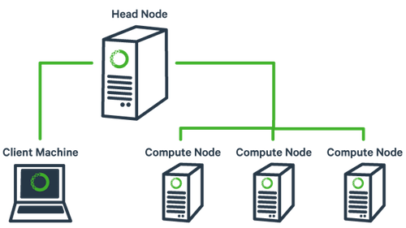
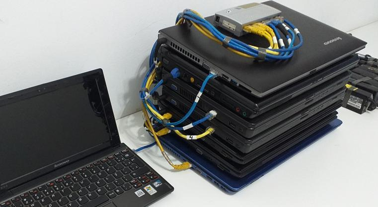

# **Cluster**

*Última atualização: 2020-03-02*


Nó |Núcleos|Threads|Processador |Instruções |Freq |Cache |RAM |GPU
:-:|:-:|:-:|:-:|:-:|:-:|:-:|:-:|-
1|6|12|Core i7-9750H|avx2, sse4.2, fma3|4 GHz|12 MB L3|8 GB|NVIDIA GeForce GTX 1050 3GB
2|4|8|Core i7-2630QM |avx, sse4.2|2.6 GHz|6 MB L3|8 GB|
3|4|8|Core i7-2630QM |avx, sse4.2|2.6 GHz|6 MB L3|6 GB|
4|2|4|Core i7-7500U |avx2, sse4.2, fma3|3.5 GHz|4 MB L3|16 GB |NVIDIA GeForce 940MX 4GB
5|2|4|Core i7-3520M |avx, sse4.2|3.6 GHz|4 MB L3|8 GB |NVIDIA GeForce GT 635M 2GB
6|2|2|Core2Duo T7200 |ssse3|2 GHz|4 MB L2|2 GB|
7|2|2|Core2Duo T7200 |ssse3|2 GHz|4 MB L2|2 GB|
8|2|2|Core2Duo T7250 |ssse3|2 GHz|2 MB L2|3 GB|
9|4|4|AMD A6-1450|avx, sse4.2|1 GHz|2 MB L2|4 GB|Radeon HD 8250
10|4|4|Allwinner H3 ARM Cortex-A7|ARMv7-A, Neon, VFPv4|1.2 GHz|0,5 MB L2|0,5 GB|Mali400 MP2 @ 600 Mhz
master   |1|2|Atom N450 |ssse3|1.6 GHz|0,5 MB L2|2 GB|


Outras specs: xubuntu 18.04.3 lts, 10/100M ethernet



Aspecto físico



## Instalação e configuração

O *hostname* coloca na hora que instala o SO. Ou então, caso já exista e o ssh (dropbear) esteja rodando, talvez seja uma boa idéia desinstalar para evitar problemas:

```console
sudo apt autoremove --purge dropbear
sudo reboot
```

Após o boot (exemplo para o node01):

```console
sudo hostname node01
```

Alterar também o que está em /etc/hostname e colocar `node01`
```console
sudo nano /etc/hostname
```

## Em todos os nós

Acrescentar todos nós a /etc/hosts:

```console
sudo nano /etc/hosts
```

no lugar de "n" completar o ip:

    192.168.n.nnn   node01
    192.168.n.nnn   node02
    192.168.n.nnn   node03
    ...
    192.168.n.nnn   master
    
Instalar ssh (dropbear) e htpdate:

```console
sudo apt install -y dropbear ntpdate
```

## No nó de login

Entrar no nó de login (ssh), e:

```console
sudo mkdir /scratch
sudo chown nobody.nogroup -R /scratch
sudo chmod 777 -R /scratch
```

Servidor NFS

```console
sudo apt install -y nfs-kernel-server
```
Configuração `sudo nano /etc/exports`

    /scratch  192.168.2.1/24(rw,sync,no_subtree_check,no_root_squash)

Ativar

```console
sudo exportfs -rav
```

## Nos demais nós

Entrar com ssh, e:

```console
sudo apt install -y nfs-common
sudo mkdir /scratch
sudo chown nobody.nogroup /scratch
sudo chmod -R 777 /scratch
```

Configurar `sudo nano /etc/fstab`:

    master:/scratch    /scratch    nfs    defaults,_netdev,noatime   0 0

Montar e conferir:

```console
sudo mount /scratch
ls /scratch
```

## Voltando para o nó de login
    
Instalar o slurm

```console
sudo apt install -y slurm-wlm
sudo slurmd -V
cd /etc/slurm-llnl
sudo cp /usr/share/doc/slurm-client/examples/slurm.conf.simple.gz .
sudo gzip -d slurm.conf.simple.gz
sudo mv slurm.conf.simple slurm.conf
```

Criar o diretório slurm spool:

```console
sudo mkdir /var/spool/slurm-llnl
sudo chown -R slurm.slurm /var/spool/slurm-llnl
```

Criar o diretório slurm pid:

```console
sudo mkdir /var/run/slurm-llnl/
sudo chown -R slurm.slurm /var/run/slurm-llnl
```

Configurar `sudo nano /etc/slurm-llnl/slurm.conf` (as linhas abaixo mostram apenas algumas configurações possíveis):

```console
ControlMachine=master
ControlAddr=192.168.n.nnn
SelectType=select/cons_res
SelectTypeParameters=CR_CPU
ClusterName=orion
SlurmUser=x
NodeName=node01 NodeAddr=192.168.n.nnn CPUs=4 State=UNKNOWN
NodeName=node02 NodeAddr=192.168.n.nnn CPUs=8 State=UNKNOWN
NodeName=node03 NodeAddr=192.168.n.nnn CPUs=8 State=UNKNOWN
...
NodeName=master NodeAddr=192.168.n.nnn CPUs=2 State=UNKNOWN
PartitionName=mycluster Nodes=node[01-07] Default=YES MaxTime=INFINITE State=UP
# comentar o NodeName e PartitionName existente
```

Configurar `sudo nano /etc/slurm-llnl/cgroup.conf`:

```console
CgroupMountpoint="/sys/fs/cgroup"
CgroupAutomount=yes
CgroupReleaseAgentDir="/etc/slurm-llnl/cgroup"
AllowedDevicesFile="/etc/slurm-llnl/cgroup_allowed_devices_file.conf"
ConstrainCores=no
TaskAffinity=no
ConstrainRAMSpace=yes
ConstrainSwapSpace=no
ConstrainDevices=no
AllowedRamSpace=100
AllowedSwapSpace=0
MaxRAMPercent=100
MaxSwapPercent=100
MinRAMSpace=30
```

Configurar `sudo nano /etc/slurm-llnl/cgroup_allowed_devices_file.conf`:

```console
/dev/null
/dev/urandom
/dev/zero
/dev/sda*
/dev/cpu/*/*
/dev/pts/*
/scratch*
```

Copiar os arquivos anteriores para /scratch para usar nos outros nós:

```console
cd /etc/slurm-llnl/
sudo cp slurm.conf cgroup.conf cgroup_allowed_devices_file.conf /scratch
sudo cp /etc/munge/munge.key /scratch
```

Iniciar

```console
sudo systemctl enable munge
sudo systemctl start munge
sudo systemctl enable slurmd
sudo systemctl start slurmd
sudo systemctl enable slurmctld
sudo systemctl start slurmctld
```

Conferir

slurmctld

```console
x@master:~$ systemctl status slurmctld.service
● slurmctld.service - Slurm controller daemon
   Loaded: loaded (/lib/systemd/system/slurmctld.service; enabled; vendor preset: enabled)
   Active: active (running) since Mon 2019-11-18 09:57:16 -03; 18min ago
     Docs: man:slurmctld(8)
  Process: 2683 ExecStart=/usr/sbin/slurmctld $SLURMCTLD_OPTIONS (code=exited, status=0/SUCCES
 Main PID: 2685 (slurmctld)
    Tasks: 7 (limit: 2293)
   CGroup: /system.slice/slurmctld.service
           └─2685 /usr/sbin/slurmctld

Nov 18 09:57:16 master systemd[1]: Starting Slurm controller daemon...
Nov 18 09:57:16 master systemd[1]: Started Slurm controller daemon.
```

scontrol
    
```console
x@master:~$ scontrol show node
NodeName=master Arch=x86_64 CoresPerSocket=1
   CPUAlloc=0 CPUErr=0 CPUTot=2 CPULoad=0.70
   AvailableFeatures=(null)
   ActiveFeatures=(null)
   Gres=(null)
   NodeAddr=192.168.n.nnn NodeHostName=master Version=17.11
   OS=Linux 5.0.0-36-generic #39~18.04.1-Ubuntu SMP Tue Nov 12 11:09:50 UTC 2019 
   RealMemory=1 AllocMem=0 FreeMem=690 Sockets=2 Boards=1
   State=IDLE ThreadsPerCore=1 TmpDisk=0 Weight=1 Owner=N/A MCS_label=N/A
   BootTime=2019-11-18T08:15:16 SlurmdStartTime=2019-11-18T09:57:15
   CfgTRES=cpu=2,mem=1M,billing=2
   AllocTRES=
   CapWatts=n/a
   CurrentWatts=0 LowestJoules=0 ConsumedJoules=0
   ExtSensorsJoules=n/s ExtSensorsWatts=0 ExtSensorsTemp=n/s
(...)
```

sinfo
    
```console
x@master:~$ sinfo
PARTITION  AVAIL  TIMELIMIT  NODES  STATE NODELIST
mycluster*    up   infinite      7   idle node[01-07]
```

Se precisar reiniciar:

```console
sudo systemctl restart systemd-networkd.service
sudo systemctl restart munge
sudo systemctl restart slurmd
sudo systemctl restart slurmctld
```

## Nos nós de execução

Entrar em cada um com ssh e instala o cliente slurm:

```console
sudo apt install -y slurmd slurm-client
```

Copiar os arquivos de configuração de /scratch

```console
sudo cp /scratch/munge.key /etc/munge/munge.key
sudo cp /scratch/slurm.conf /etc/slurm-llnl/slurm.conf
sudo cp /scratch/cgroup* /etc/slurm-llnl
sudo systemctl restart munge
sudo systemctl restart slurmd
```

Iniciar

```console
sudo systemctl enable munge
sudo systemctl start munge
sudo systemctl enable slurmd
sudo systemctl start slurmd
```

Conferir

munge

```console
x@node01:~$ munge -n | unmunge
STATUS:           Success (0)
ENCODE_HOST:      node01 (127.0.1.1)
ENCODE_TIME:      2019-11-18 10:23:31 -0300 (1574083411)
DECODE_TIME:      2019-11-18 10:23:31 -0300 (1574083411)
TTL:              300
CIPHER:           aes128 (4)
MAC:              sha256 (5)
ZIP:              none (0)
UID:              x (1000)
GID:              x (1000)
LENGTH:           0
```

slurmd

```console
x@node01:~$ sudo slurmd -C
NodeName=node01 CPUs=4 Boards=1 SocketsPerBoard=1 CoresPerSocket=2 ThreadsPerCore=2 RealMemor=15906
UpTime=2-23:16:18
```

## Testando o cluster

No nó de login:

```console
x@master:~$ sinfo
PARTITION  AVAIL  TIMELIMIT  NODES  STATE NODELIST
mycluster*    up   infinite      7   idle node[01-07]
```
Rodando o comando `hostname` em 7 nós:

```console
x@master:~$ srun --nodes=7 hostname
node04
node07
node02
node05
node01
node03
node06
```

Rodando 30 processos:

```console
x@master:~$ srun --ntasks=30 hostname
node01
node01
node01
node01
node07
...
node03
node03
```

Combinando nós e processos:

```console
x@master:~$ srun --nodes=4 --ntasks-per-node=2 hostname
node01
node01
node04
node03
node02
node03
node02
node04
```

Rodando somente em determinados nós

```console
x@master:~$ srun --nodelist=node01,node07 --ntasks=8 hostname
node01
node07
node01
node07
node01
node07
node07
node01
```

squeue

```console
x@master:~$ squeue
            JOBID PARTITION     NAME     USER ST       TIME  NODES NODELIST(REASON)
```

Agendar um arquivo de lote `/scratch/helloworld.sh`

```sh
#!/bin/bash
#SBATCH --nodes=1
#SBATCH --ntasks-per-node=1
#SBATCH --partition=mycluster

cd $SLURM_SUBMIT_DIR

echo "Hello, World!" > helloworld.txt
echo "OK."
```

Rodar

```console
x@master:/scratch$ sbatch helloworld.sh
Submitted batch job 128
```

Saídas

slurm-128.out

    OK.

helloworld.txt

    Hello, World!

## Informações adicionais

Para verificar se todos os nós estão com os diretórios scratch montados, talvez uma maneira seja:

```console
x@master:~$ cd /scratch/
x@master:/scratch$ touch teste.txt
x@master:/scratch$ srun --nodes=7 ls /scratch/teste.txt
/scratch/teste.txt
/scratch/teste.txt
/scratch/teste.txt
/scratch/teste.txt
/scratch/teste.txt
/scratch/teste.txt
/scratch/teste.txt
x@master:/scratch$ rm teste.txt

```

Para montar todos os diretórios /scratch de uma vez:

```console
x@master:/scratch$ srun --nodes=7 sudo mount /scratch
```

Mudar o estado de um ou mais nós:

```console
x@master:/scratch$ sudo scontrol update nodename=node[04-05] state=FUTURE
x@master:/scratch$ sinfo
PARTITION  AVAIL  TIMELIMIT  NODES  STATE NODELIST
mycluster*    up   infinite      5   idle node[01-03,06-07]
x@master:/scratch$ sudo scontrol update nodename=node[04-05] state=RESUME
x@master:/scratch$ sinfo
PARTITION  AVAIL  TIMELIMIT  NODES  STATE NODELIST
mycluster*    up   infinite      7   idle node[01-07]
```

Reiniciar um nó:

```console
x@node01:~$ sudo /etc/init.d/slurmd stop
[ ok ] Stopping slurmd (via systemctl): slurmd.service.
x@node01:~$ sudo /etc/init.d/slurmd startclean
 * Starting slurm compute node daemon slurmd                   [ OK ] 
```

Mostrar informações do slurmd

```console
x@node01:~$ scontrol show slurmd
Active Steps             = NONE
Actual CPUs              = 4
Actual Boards            = 1
Actual sockets           = 1
Actual cores             = 2
Actual threads per core  = 2
Actual real memory       = 15906 MB
Actual temp disk space   = 119640 MB
Boot time                = 2019-11-18T10:00:07
Hostname                 = node01
Last slurmctld msg time  = 2019-11-18T10:31:12
Slurmd PID               = 12225
Slurmd Debug             = 3
Slurmd Logfile           = /var/log/slurm-llnl/slurmd.log
Version                  = 17.11.2
```


# REFERÊNCIAS

* https://medium.com/@glmdev/building-a-raspberry-pi-cluster-784f0df9afbd
* https://www.linuxwave.info/2019/10/installing-slurm-workload-manager-job.html
* https://slurm.schedmd.com/
* https://www.eidos.ic.i.u-tokyo.ac.jp/~tau/lecture/parallel_distributed/2016/html/fix_broken_slurm.html
